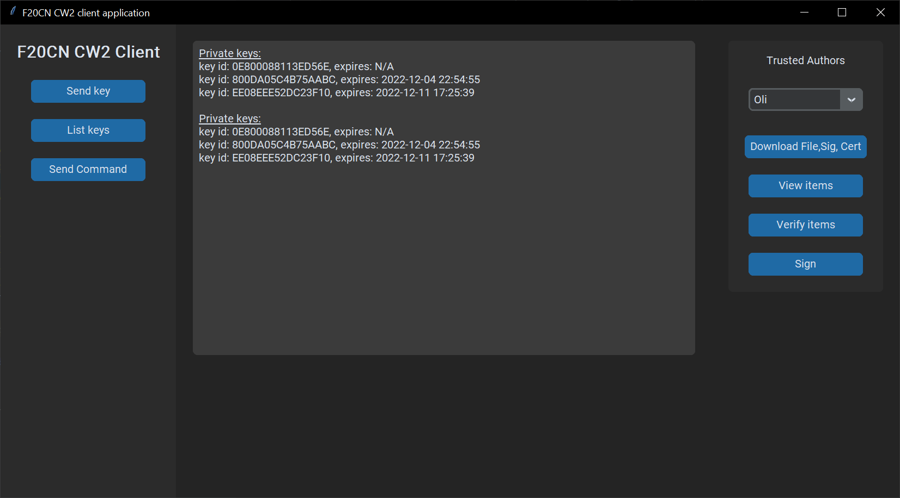

# F20CN Pair Report
Authored by Oli Radlett (H00322454) and Kate Levi (H00347035)

<!-- why are we doing this? -->
Seriously, why are we doing this?

## Introduction
<!-- Succinctly describe the project  -->
### Aims
<!-- discussing what you expect to learn from the assignment in general (and for
each task) -->
The aim of this project is to gain an understanding of how computer networks can
verify document authenticity through the development of a simple application. While
developing this application we will also learn how certificates and signatures
work and apply this information in a practical setting. By applying and ensuring 
trust we will gain knowledge and experience on how trust works with certificates 
and why certificates and signatures play such a vital role in verifying authenticity.

In addition to the theoretical side, this project also gives us an opportunity to 
expand our programming skills. We will need to decide on the best language to 
develop our application in and then work with the networking and certificate 
libraries it provides as well as implementing an intuitive and functional user 
interface.

Finally, as the project is to be carried out in pairs we also aim to become more 
effective at collaboration and working as part of a team, a skill that will be 
crucial post university.
### Objectives
<!-- Things needed to achieve aims -->
In order to achieve our aims outlined above, we first had to create a comprehensive
set of requirements. For us to consider our project successful we need to have 
completed all of our Must requirements. Time permitting we aim to complete most of our
Should requirements and least some of our Could requirements. These requirements can
be found in detail below.

We also need to work effectively as a team to achieve our aims. This involves
communicating respectfully and professionally, having regular meetings, and making
use of the collaborative tools available to us. These include Microsoft teams for 
regular and scheduled meetings, GitHub for source control and peer review and Microsoft
Visual Studio Code + Live Share extension for working on the document in real time. By
applying real-world techniques to our workflow we will gain experience that will
help prepare us for working on real software projects in the future.

<!-- what is our solution? -->
### Requirements
<!-- What functions do we need the program to do? -->
Using MoSCoW, the requirements for this program are analysed and categorised, based on the following:

**Must Have:** Critical for the completion of the project.
**Should Have:** Important, should be delivered but not critical for the success of the project.
**Could Have:** Not important, should be delivered if there is extra time, not critical for the success of the project.
**Won't Have:** Not needed in the current project.

Requirements are divided into requirements that are needed for the program to work (functional requirements) and non-function requirements, which limits how functional requirements should be implemented.

**Functional Requirements**
|  ID  |  Name  |  Priority  |
|------|--------|------------|
|FR-1| Server can sign PGP certificates|Must|
|FR-2| Server can list PGP certificates of trusted authors (broadcastlist)|Must|
|FR-3| Server can send a document, with its signature, and PGP certificate|Must|
|FR-4| Client can receive a list PGP certificates of trusted authors|Must|
|FR-5| Client can verify the authenticity of the signatures of FR-4 (receivechecklist)|Must|
|FR-6| Client can receive a document, its signature and PGP certificate|Must|
|FR-7| Client can verify a received  document, its signature and PGP certificate|Must|

**Non-functional Requirements**
|  ID  |  Name  |  Priority  |
|------|--------|------------|
|NFR-1| Command line interface|Must|
|NFR-2| GUI | Could|
|NFR-3| Should use pyenv to control packages and python version | Should|
|NFR-4| Use a git server for version control | Must|
|NFR-5| Should use unit testing to verify functional requirements | Should|

## Application

## Design
### Environment
The application is developed using Windows, Python 3.11.0, and gnupg version 1.4.9.
Gnupg version 1.4.9 was chosen as it was the version tested by the developers of gnupg-python, which is a gnupg wrapper for python.
Python 3.11.0 was chosen as it was the latest at the time of starting development.
For the UI it was chosen to use the CustomTkinter library, as it's easy to use and have a modern look.
We each used our own personal preference for code editors. Oli chose JetBrains PyCharm and Kate chose visual studio code.
Both of these were chosen based on experience and familiarity and both worked well while working on this project.

### Certificates
<!-- List certificates -->
<!-- cut-and-paste the command line with the responses, documenting the steps
taken on each of the tasks above -->
<!-- Justify how the certs were created and used -->
#### GPG Keys
##### Creating
gpg --full-generate-key
##### Exporting
gpg --export-secret-keys --armor > private.asc
gpg --export-keys --armor > public.asc
#### X509 Key
openssl genrsa -out key_private.key 4096
openssl req -new -key key.key -out my.csr
openssl x509 -in key.crt -pubkey -noout -out key_public_.key
##### Signing
gpg --sign file.txt
##### Verifying
### Code Structure
pgp.py - Contains methods used to interface with the GPG binary
#### Client
client.py - Creates a socket connection to the server, receives data from the server and verifies it
main.py - Contains the UI code and calls starts the socket connection defined in client.py
#### Server
server.py - Creates the server socket and contains functions for encoding and sending data back to the client
main.py - Starts the server defined in server.py and manages client threads

## Afterthoughts
### Challenges
One major challenge we had when developing this project was Kate's illness which slowed down development significantly.
However, we were granted a Mitigating Circumstance meaning we could submit within 5 working days of the deadline.
This was still challenging because it took us up to exam week however we still feel we managed to write a good
application.
There were also lots of competing deadlines which stopped us spending all our time on this project. This is something
we probably should have anticipated and mitigated against. However, we did manage to finish almost everything we wanted 
to
We also struggled with libraries that were either outdated or had poor documentation. This made the planning stage of
our application even more valuable because we didn't need to waste too much time trying to get these libraries to work.
### Observations
One observation we had on this project was that it took us a lot longer than we expected. This wasn't helped by
competing deadlines and the start of the exam period as mentioned above. The application ended up being more complex
than we accounted for 
<!-- Explain any observations that are interesting or surprising -->
### Reflection
On reflection, we would have spent longer in the planning stage and created a time plan which would have allowed us to
work around our other deadlines. Considering this and the Mitigating Circumstances of our project we were
quite happy with the requirements we met. These can be seen below

## Conclusion
We are quite happy with our finished client and server applications however we feel that with more time and less
competing deadlines we would have produced a slightly more polished solution. In terms of our requirements, we
successfully met requirements FR-1, FR-2, FR-3, FR-4, FR-5, FR-6 however we did not manage to complete FR-7. NFR-1, 
NFR-2, NFR3 and NFR4 were all successfully completed however NFR-5 was incomplete.